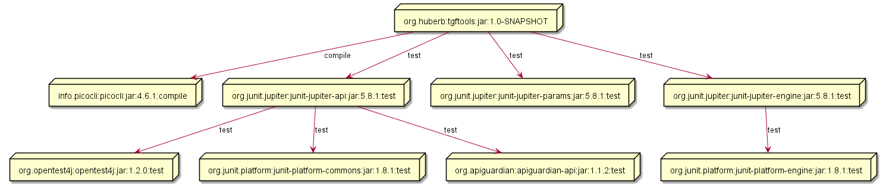
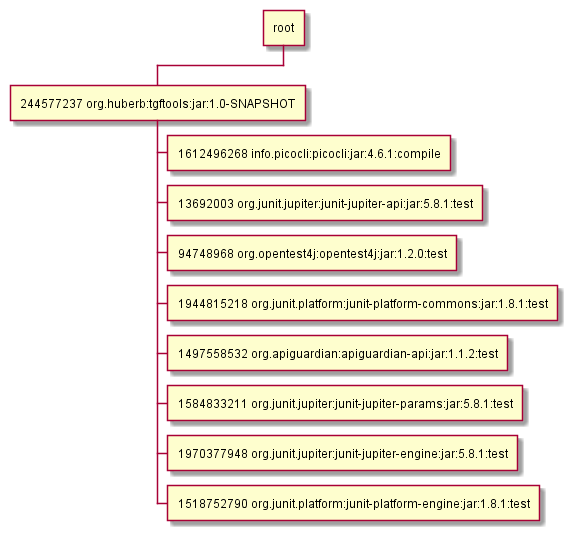
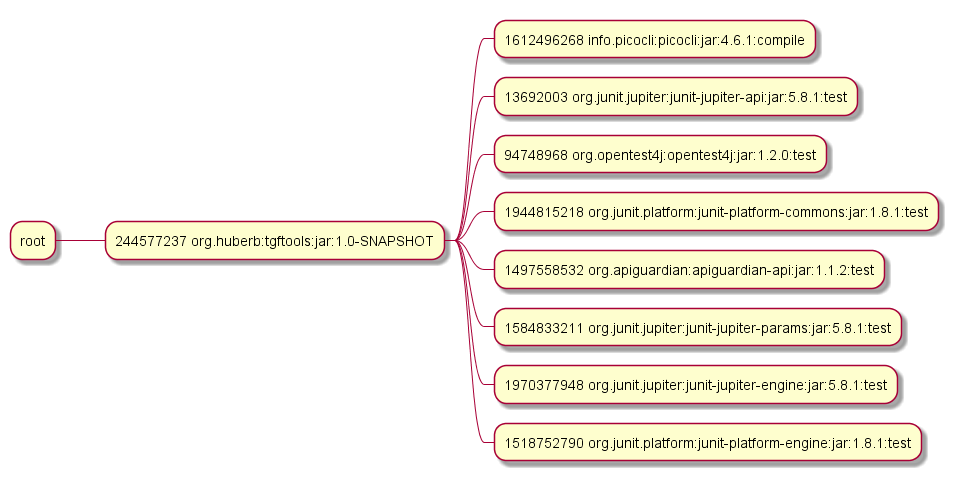
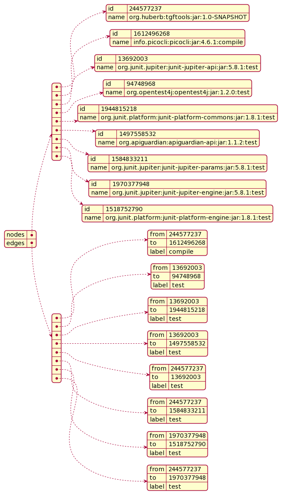

= tgftools
A simple command line tool reading and converting TGF data to various output formats.
:toc:

== Overview

A simple command line tool reading and converting TGF data to

* PLANTUML
* CSV
* JSON
* YAML
* DATALOG

Following command line options are available

....
Usage: tgfMain [-hV] [--convert-csv] [--convert-datalog-property]
               [--convert-datalog-value] [--convert-json] [--convert-puml]
               [--convert-puml-mindmap] [--convert-puml-wbs] [--convert-yaml]
               [--overwrite-outputfile] [-f=<tgfFile>] [-o=<outputFile>]
parse, and convert TGF file format
      --convert-csv        convert TGF to csv
      --convert-datalog-property
                           convert TGF to datalog property schema
      --convert-datalog-value
                           convert TGF to datalog value schema
      --convert-json       convert TGF to json
      --convert-puml       convert TGF to puml
      --convert-puml-mindmap
                           convert TGF to puml mindmap
      --convert-puml-wbs   convert TGF to puml wbs
      --convert-yaml       convert TGF to yaml
  -f, --file=<tgfFile>     read from TGF file, if not specified read TGF from
                             stdin
  -h, --help               Show this help message and exit.
  -o, --output=<outputFile>
                           write to file, if not specified write to stdout
      --overwrite-outputfile
                           overwrite existing output file
  -V, --version            Print version information and exit.
....

== TGF Format

TGF stands for Trivial-Graphic-Format. It simply defines a number of
nodes, and edges.

The file syntax is simple:

....
file := node_list
    '#'
    edge_list

node_list := node_item node_list | node_item | []
node_item := node_id ' ' [node_name]
edge_list := edge_item edge_list | edge_item
edge_item := source_node_id ' ' target_node_id ' ' [edge_name]
source_node_id := node_id
target_node_id := node_id
....

An simple example with 2 nodes, and 1 edge:

....
1 Alice
2 Bob
#
2 1 hello
....

== Use Case Generate TGF from Maven dependency:tree

You can generate a maven dependency tree in TGF-Format, like

....
mvn -DoutputType=tgf -DoutputFile=dependency_tree.tgf dependency:tree
....

Next you can convert the file dependency_tree.tgf using this command
line tool, like

....
java -jar target/tgftools-1.0-SNAPSHOT-tgfmain.jar \
  --file=dependency_tree.tgf --convert-puml
....

The above command will read the file dependency_tree.tgf, and output a
plantuml representation to stdout.

== Use Case Convert TGF to CSV

You can convert a TGF file to CSV using the command line option
-convert-csv.

The first column type describes if the csv row describes either a
_node_, or an _edge_.

For a node entry _id_from_ describes the _node_id_, and _name_to_
describes the node name. The column _label_ is alway empty for a node
node entry.

For an edge entry _id_form_ describes the start node of the edge,
_name_to_ describes the end node of the edge. Finally _label_ describes
the optional label of the edge.

=== Example CSV

....
"type","id_from","name_to","label"
"node","244577237","org.huberb:tgftools:jar:1.0-SNAPSHOT",""
"node","1612496268","info.picocli:picocli:jar:4.6.1:compile",""
"node","13692003","org.junit.jupiter:junit-jupiter-api:jar:5.8.1:test",""
"node","94748968","org.opentest4j:opentest4j:jar:1.2.0:test",""
"node","1944815218","org.junit.platform:junit-platform-commons:jar:1.8.1:test",""
"node","1497558532","org.apiguardian:apiguardian-api:jar:1.1.2:test",""
"node","1584833211","org.junit.jupiter:junit-jupiter-params:jar:5.8.1:test",""
"node","1970377948","org.junit.jupiter:junit-jupiter-engine:jar:5.8.1:test",""
"node","1518752790","org.junit.platform:junit-platform-engine:jar:1.8.1:test",""
"edge","244577237","1612496268","compile"
"edge","13692003","94748968","test"
"edge","13692003","1944815218","test"
"edge","13692003","1497558532","test"
"edge","244577237","13692003","test"
"edge","244577237","1584833211","test"
"edge","1970377948","1518752790","test"
"edge","244577237","1970377948","test"
....

== Use Case Convert TGF to PUML

You can convert a TGF file to PLANTUML using the command line option
-convert-puml.

=== Example PUML

....
@startuml

' nodes
node "org.huberb:tgftools:jar:1.0-SNAPSHOT" as 244577237
node "info.picocli:picocli:jar:4.6.1:compile" as 1612496268
node "org.junit.jupiter:junit-jupiter-api:jar:5.8.1:test" as 13692003
node "org.opentest4j:opentest4j:jar:1.2.0:test" as 94748968
node "org.junit.platform:junit-platform-commons:jar:1.8.1:test" as 1944815218
node "org.apiguardian:apiguardian-api:jar:1.1.2:test" as 1497558532
node "org.junit.jupiter:junit-jupiter-params:jar:5.8.1:test" as 1584833211
node "org.junit.jupiter:junit-jupiter-engine:jar:5.8.1:test" as 1970377948
node "org.junit.platform:junit-platform-engine:jar:1.8.1:test" as 1518752790
' edges
244577237 --> 1612496268 : compile
13692003 --> 94748968 : test
13692003 --> 1944815218 : test
13692003 --> 1497558532 : test
244577237 --> 13692003 : test
244577237 --> 1584833211 : test
1970377948 --> 1518752790 : test
244577237 --> 1970377948 : test

@enduml
....

=== Example Rendered PUML

== Use Case Convert TGF to PUML WBS

You can convert a TGF file to PUML wbs (work breakdown structure) using
the command line option -convert-puml-wbs.

=== Example PUML WBS

....
@startwbs

* root
** 244577237 org.huberb:tgftools:jar:1.0-SNAPSHOT
*** 1612496268 info.picocli:picocli:jar:4.6.1:compile
*** 13692003 org.junit.jupiter:junit-jupiter-api:jar:5.8.1:test
*** 94748968 org.opentest4j:opentest4j:jar:1.2.0:test
*** 1944815218 org.junit.platform:junit-platform-commons:jar:1.8.1:test
*** 1497558532 org.apiguardian:apiguardian-api:jar:1.1.2:test
*** 1584833211 org.junit.jupiter:junit-jupiter-params:jar:5.8.1:test
*** 1970377948 org.junit.jupiter:junit-jupiter-engine:jar:5.8.1:test
*** 1518752790 org.junit.platform:junit-platform-engine:jar:1.8.1:test

@endwbs
....

=== Example Rendered PUML WBS

== Use Case Convert TGF to PUML MINDMAP

You can convert a TGF file to PUML using the command line option
-convert-puml-mindmap.

=== Example PUML MINDMAP

....
@startmindmap

* root
** 244577237 org.huberb:tgftools:jar:1.0-SNAPSHOT
*** 1612496268 info.picocli:picocli:jar:4.6.1:compile
*** 13692003 org.junit.jupiter:junit-jupiter-api:jar:5.8.1:test
*** 94748968 org.opentest4j:opentest4j:jar:1.2.0:test
*** 1944815218 org.junit.platform:junit-platform-commons:jar:1.8.1:test
*** 1497558532 org.apiguardian:apiguardian-api:jar:1.1.2:test
*** 1584833211 org.junit.jupiter:junit-jupiter-params:jar:5.8.1:test
*** 1970377948 org.junit.jupiter:junit-jupiter-engine:jar:5.8.1:test
*** 1518752790 org.junit.platform:junit-platform-engine:jar:1.8.1:test

@endmindmap
....

=== Example Rendered PLANTUML MINDMAP

== Use Case Convert TGF to JSON

You can convert a TGF file to CSV using the command line option
-convert-json.

=== Example JSON

....
{
"nodes": [
{"id":"244577237","name":"org.huberb:tgftools:jar:1.0-SNAPSHOT"},
{"id":"1612496268","name":"info.picocli:picocli:jar:4.6.1:compile"},
{"id":"13692003","name":"org.junit.jupiter:junit-jupiter-api:jar:5.8.1:test"},
{"id":"94748968","name":"org.opentest4j:opentest4j:jar:1.2.0:test"},
{"id":"1944815218","name":"org.junit.platform:junit-platform-commons:jar:1.8.1:test"},
{"id":"1497558532","name":"org.apiguardian:apiguardian-api:jar:1.1.2:test"},
{"id":"1584833211","name":"org.junit.jupiter:junit-jupiter-params:jar:5.8.1:test"},
{"id":"1970377948","name":"org.junit.jupiter:junit-jupiter-engine:jar:5.8.1:test"},
{"id":"1518752790","name":"org.junit.platform:junit-platform-engine:jar:1.8.1:test"}
],
"edges": [
{"from":"244577237","to":"1612496268","label":"compile"},
{"from":"13692003","to":"94748968","label":"test"},
{"from":"13692003","to":"1944815218","label":"test"},
{"from":"13692003","to":"1497558532","label":"test"},
{"from":"244577237","to":"13692003","label":"test"},
{"from":"244577237","to":"1584833211","label":"test"},
{"from":"1970377948","to":"1518752790","label":"test"},
{"from":"244577237","to":"1970377948","label":"test"}
]
}
....

=== Example Reendered JSON

Using plantuml feature ``@startjson/@endjson'' the JSON output is
rendered

== Use Case Convert TGF to YAML

You can convert a TGF file to CSV using the command line option
-convert-yaml.

=== Example YAML

....
## YAML Template.
---
nodes:
  -
    id: "244577237"
    name: "org.huberb:tgftools:jar:1.0-SNAPSHOT"
  -
    id: "1612496268"
    name: "info.picocli:picocli:jar:4.6.1:compile"
  -
    id: "13692003"
    name: "org.junit.jupiter:junit-jupiter-api:jar:5.8.1:test"
  -
    id: "94748968"
    name: "org.opentest4j:opentest4j:jar:1.2.0:test"
  -
    id: "1944815218"
    name: "org.junit.platform:junit-platform-commons:jar:1.8.1:test"
  -
    id: "1497558532"
    name: "org.apiguardian:apiguardian-api:jar:1.1.2:test"
  -
    id: "1584833211"
    name: "org.junit.jupiter:junit-jupiter-params:jar:5.8.1:test"
  -
    id: "1970377948"
    name: "org.junit.jupiter:junit-jupiter-engine:jar:5.8.1:test"
  -
    id: "1518752790"
    name: "org.junit.platform:junit-platform-engine:jar:1.8.1:test"
edges:
  -
    from: "244577237"
    to: "1612496268"
    label: "compile"
  -
    from: "13692003"
    to: "94748968"
    label: "test"
  -
    from: "13692003"
    to: "1944815218"
    label: "test"
  -
    from: "13692003"
    to: "1497558532"
    label: "test"
  -
    from: "244577237"
    to: "13692003"
    label: "test"
  -
    from: "244577237"
    to: "1584833211"
    label: "test"
  -
    from: "1970377948"
    to: "1518752790"
    label: "test"
  -
    from: "244577237"
    to: "1970377948"
    label: "test"
....

=== Example Reendered YAML

Using plantuml feature ``@startyaml/@endyaml'' the JSON output is
rendered

== References

* TGF : https://en.wikipedia.org/wiki/Trivial_Graph_Format
* PLANTUML : https://plantuml.com/
